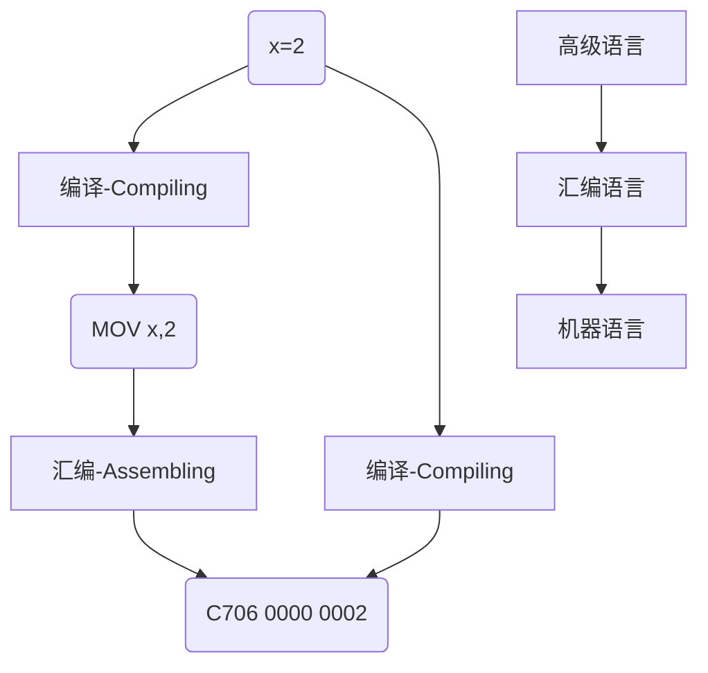
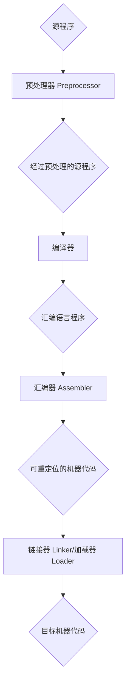
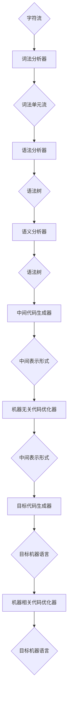

# 编译原理 —— 绪论

- 终于开始学习编译原理了，这次借着暑假一个月的时间来补补知识点。
- 学习资源来自**中国大学生慕课APP**，资源是哈工大提供的。现在听了两讲的内容，感觉老师讲解的很不错。

#### 编译



- 高级语言(High level language)

  - 类似于数学定义或自然语言的简洁形式

  - 接近人类表达习惯
  - 不依赖于特定的机器
  - 编写效率高

- 汇编语言(Assembly language)

  - 引入助记符
  - 依赖于特定机器，非计算机专业人员使用受限制
  - 编写效率依然很低

- 机器语言(Machine language)

  - 可以被计算机直接理解
  - 与人类表达相差太远
  - 难记忆，难编写，难阅读

上面的图展示了三种层次语言的转化过程，而其中**编译**负责的是：将**高级语言(源语言)**翻译成***汇编语言或机器语言（目标语言）***的任务。

#### 编译器



- 预处理器(Preprocessor)
  - 把存储在不同文件中的源程序聚合在一起
  - 把被称为宏的缩写语句转换为原始语句
- 可重定位(Relocatable)
  - 在内存中存放的其实位置L不同
- 加载器(Loader)
  - 修改可重定位地址
  - 将修改后的指令和数据放到内存中适当的位置
- 链接器(Linker)
  - 将多个可重定位的机器代码文件(包括 库文件)连接到一起
  - 解决外部内存地址问题

#### 人工翻译流程

1. 分析源语言得到句子的语义
   - 词法分析（Lexical Analysis）
   - 语法分析（Syntax Analysis）
   - 语义分析（Semantic Analysis）
2. 生成目标语言，得到目标语言句子

## 编译器结构



- 分析部分/前端（front end）：与源语言相关        词法分析器-->中间代码生成器
- 总和部分/后端（back end）：与目标语言相关     目标代码生成器-->机器相关代码优化器

### 词法分析/扫描（Scanning）

- 主要任务：从左到右逐行扫描源程序的字符，识别出各个单词，确定单词的类型。将识别出的单词转换为统一的机内表示——词法单元（token）形式。
- $ token : <种别码，属性值> $

|      | 单词类型 | 种别                                                         | 种别码                         |
| ---- | -------- | ------------------------------------------------------------ | ------------------------------ |
| 1    | 关键字   | program、if、else、then、...                                 | 一次一码                       |
| 2    | 标识符   | 变量名、数组名、记录名、过程名、...                          | 多次一码                       |
| 3    | 常量     | 整型、浮点型、字符型、布尔型、...                            | 一型一码                       |
| 4    | 运算符   | 算术（+ - * / ++ --）<br />关系（> < == != >= <=）<br />逻辑（& \| ~） | 一次一码<br />或<br />一型一码 |
| 5    | 界限符   | ；（ ）= { } ...                                             | 一次一码                       |

- 例：词法分析后得到的token序列

输入：while(value != 100) {num++;}

输出：

| while | <WHILE, _ >  |
| :---: | :----------: |
|   (   |  <SLP, _ >   |
| value | <IDN, value> |
|  !=   |   <NE, _ >   |
|  100  | <CONST, 100> |
|   )   |  <SRP, _ >   |
|   {   |   <LP, _ >   |
|  num  |  <IDN, num>  |
|  ++   |  <INC, _ >   |
|   ;   |  <SEMI, _ >  |
|   }   |   <RP, _ >   |

### 语法分析（parsing）

- 语法分析器从词法分析器输出的token序列中识别出各类短语，并构造语法分析树（parse tree）。
- 具体的例题图之后有时间再贴吧。

### 语义分析

- 收集标识符的属性信息
  - 种属（Kind）
    - 简单变量、复合变量（数组、记录...）、过程...
  - 类型（Type）
    - 整型、实型、字符型、布尔型、指针型、...
  - 存储位置、长度
  - 值
  - 作用域
  - 参数和返回值信息
    - 参数个数、参数类型、参数传递方式、返回值类型...
  - 符号表：存放标识符的属性信息的数据结构
- 语义检查
  - 变量或过程未经声明就使用
  - 变量或过程名重复声明
  - 运算分量类型不匹配
  - 操作符与操作数之间的类型不匹配
    - 数组下标不是整数
    - 对非数组变量使用数组访问操作符
    - 对非过程名使用过程调用操作符
    - 过程调用的参数类型或数目不匹配
    - 函数返回类型有误

### 中间代码生成

- 常用的中间表示形式
  - 三地址码（Three-address Code）
    - 三地址码由类似于汇编语言的指令序列组成，每个指令最多有三个操作数。
  - 语法结构树/语法树（Syntax Trees）
- 三地址指令的表示
  - 四元式（Quadruples）
  - 三元式（Triples）
  - 间接三元式（Indirect triples）
- 例：三地址指令的四元式表示：

|      x = y *op* x       |   (op, y, z, x)   |
| :---------------------: | :---------------: |
|      x = **op** y       |   (op, y, _, x)   |
|        x **=** y        |   (=, y, _, x)    |
| if x **relop** y goto n | (relop, x, y, n)  |
|       **goto** n        |  (goto, _, _, n)  |
|       **param** x       | (param, _, _, x)  |
|      **call** p, n      |  (call, p, n, _)  |
|      **return** x       | (return, _, _, x) |
|  x **=** y **[**i**]**  |  (=[], y, i, x)   |
|    x **[**i**]** = y    |  ([]=, y, x, i)   |
|       x = **&** y       |   (&, y, _, x)    |
|       x = ***** y       |   (=*, y, _, x)   |
|       *****x = y        |   (*=, y, _, x)   |

- 中间代码生成例子：

输入：

``` c
while a<b do
    if c<5 then
        while x>y do
            z=x+1;
	else x=y;
```

输出：

| 相对地址 |     四元式      |
| :------: | :-------------: |
|   100    | (j<, a, b, 102) |
|   101    | (j, _, _, 112)  |
|   102    | (j<, c, 5, 104) |
|   103    | (j, _, _, 110)  |
|   104    | (j>, x, y, 106) |
|   105    | (j, _, _, 100)  |
|   106    |  (+, x, 1, t1)  |
|   107    |  (=, t1, _, z)  |
|   108    | (j, _, _, 104)  |
|   109    | (j, _, _, 100)  |
|   110    |  (=, y, _, x)   |
|   111    | (j, _, _, 100)  |
|   112    |                 |

### 目标代码生成器

- 目标代码生成以源程序的中间表示形式作为输入，并把它映射到目标语言。
- 目标代码生成的一个重要任务是为程序中使用的变量合理地分配寄存器。

### 代码优化

- 为改进代码所进行的等价程序变换，使其运行得更快一些、占用空间更少一些，或者二者兼顾。